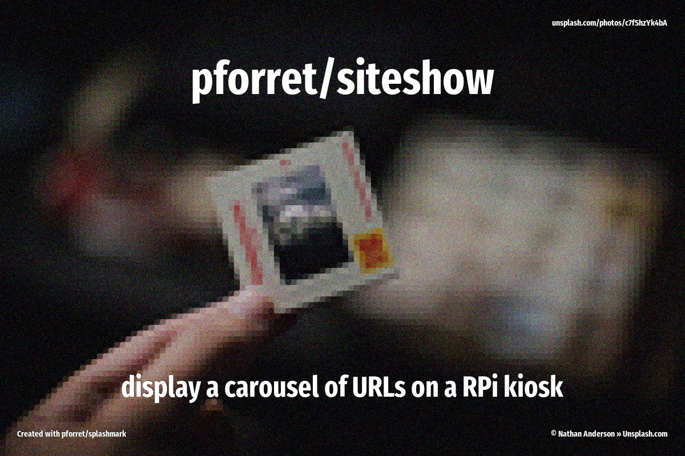

[](https://basher.gitparade.com/package/)

# siteshow_pi



Show web pages in carousel on Raspberry Pi - to be used as e.g. a dashboard display

## 🔥 Usage

```
Program: siteshow_pi 0.1.0 by peter@forret.com
Updated: May 16 22:54:48 2021
Description: This is my script siteshow_pi
Usage: siteshow_pi [-h] [-q] [-v] [-f] [-l <log_dir>] [-t <tmp_dir>] [-B <browser>] [-C <category>] [-D <display>] [-I <install>] [-W <wait>] <action>
Flags, options and parameters:
    -h|--help        : [flag] show usage [default: off]
    -q|--quiet       : [flag] no output [default: off]
    -v|--verbose     : [flag] output more [default: off]
    -f|--force       : [flag] do not ask for confirmation (always yes) [default: off]
    -l|--log_dir <?> : [option] folder for log files   [default: /Users/pforret/log/siteshow_pi]
    -t|--tmp_dir <?> : [option] folder for temp files  [default: /tmp/siteshow_pi]
    -B|--browser <?> : [option] browser to use: chromium/firefox  [default: chromium]
    -C|--category <?>: [option] screen category
    -D|--display <?> : [option] display ID
    -I|--install <?> : [option] folder for installing scripts  [default: /home/pi]
    -W|--wait <?>    : [option] wait between pages  [default: 30]
    <action>         : [parameter] action to perform: install/display

### TIPS & EXAMPLES
* use siteshow_pi install to install the RPi as a display server
  siteshow_pi install
* use siteshow_pi display to .start display
  siteshow_pi display
* use siteshow_pi check to check if this script is ready to execute and what values the options/flags are
  siteshow_pi check
* use siteshow_pi env to generate an example .env file
  siteshow_pi env > .env
* use siteshow_pi update to update to the latest version
  siteshow_pi check
```

## ⚡️ Examples

```bash
> siteshow_pi .
# start PhpStorm with current folder as project
```

## 🚀 Installation

with [basher](https://github.com/basherpm/basher)

	$ basher install pforret/siteshow_pi

or with `git`

	$ git clone https://github.com/pforret/siteshow_pi.git
	$ cd siteshow_pi

## 📝 Acknowledgements

* script created with [bashew](https://github.com/pforret/bashew)

&copy; 2021 Peter Forret
